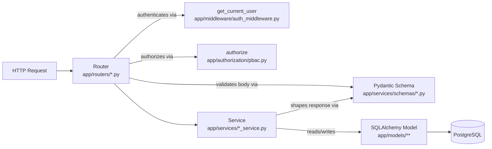
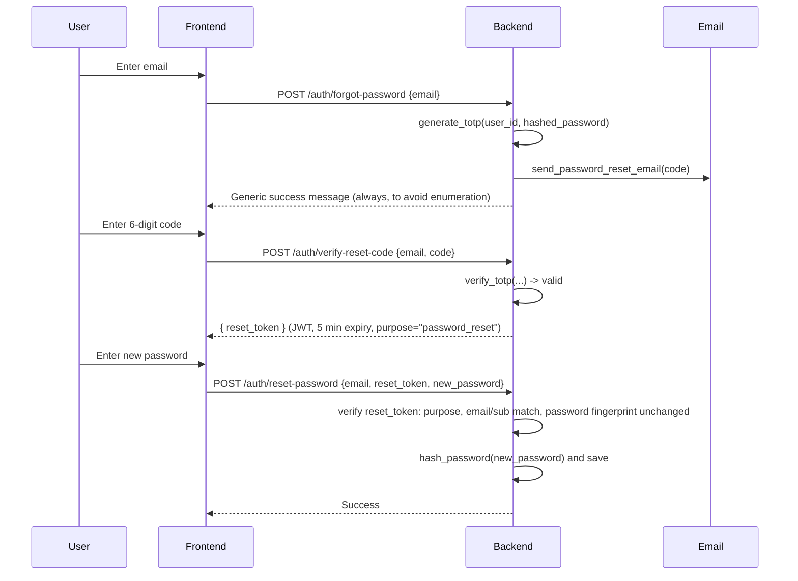

# ProjectFlow — Backend

A FastAPI backend for the ProjectFlow Project Management System, providing authentication, project & task management, project membership, a dashboard analytics endpoint, and global search — all backed by PostgreSQL via SQLAlchemy. This is the API consumed by the React frontend documented in [`../Frontend/README.md`](../Frontend/README.md).

> This document describes only what is actually implemented in `app/`. Where the code takes a shortcut (e.g. no database migrations, no ASGI-level auth middleware despite the folder name), it's called out explicitly rather than glossed over.

---

## Table of Contents

1. [Project Overview](#project-overview)
2. [Architecture](#architecture)
3. [Tech Stack](#tech-stack)
4. [Folder Structure](#folder-structure)
5. [Database Schema Overview](#database-schema-overview)
6. [Authentication & JWT Flow](#authentication--jwt-flow)
7. [PBAC Implementation](#pbac-implementation)
8. [TOTP Password Reset Flow](#totp-password-reset-flow)
9. [Email Notification Flow](#email-notification-flow)
10. [API Documentation Overview](#api-documentation-overview)
11. [Environment Setup](#environment-setup)
12. [Database Migration / Setup](#database-migration--setup)
13. [Running Locally](#running-locally)
14. [Docker Setup](#docker-setup)
15. [Testing](#testing)
16. [Logging & Error Handling](#logging--error-handling)
17. [Deployment Steps](#deployment-steps)
18. [Troubleshooting](#troubleshooting)
19. [Future Enhancements](#future-enhancements)

---

## Project Overview

The backend exposes a REST API (FastAPI, auto-documented via OpenAPI) covering:

- **Authentication** — registration, login (JWT), logout, profile settings, and a stateless TOTP-based forgot-password flow.
- **Projects** — CRUD, scoped to the owner and its members, enriched with "list of values" (LOV) lookups (category, priority, project type, status) and computed task metrics.
- **Tasks** — CRUD, scoped by project membership, with assignment, priority/status/task-type classification, and automatic email notification on assignment.
- **Project Members** — add/remove members from a project (owner-only mutation).
- **Dashboard** — a single aggregated telemetry endpoint (pending tasks, task distribution, time-based analytics, recent tasks) for the frontend dashboard.
- **Global Search** — fuzzy search across projects and tasks the current user has access to.
- **PBAC (Policy-Based Access Control)** — explicit, testable authorization functions enforced per-route, independent of and in addition to JWT authentication.

---

## Architecture

The codebase follows a layered **Router → Service → Schema → Model** pattern:



**In practice:**

1. **Router** (`app/routers/*.py`) declares the endpoint, its path, and its FastAPI dependencies: `Depends(get_current_user)` for authentication and, for protected mutations, an explicit call to `authorize(...)` for PBAC. FastAPI validates the incoming JSON body against a **request schema** automatically.
2. **Service** (`app/services/*_service.py`) contains the actual business logic — it receives already-validated Pydantic data and a SQLAlchemy `Session`, performs whatever queries/writes are needed, and returns data shaped by a **response schema**.
3. **Schema** (`app/services/schemas/*.py`) — Pydantic models for both request validation and response shaping (e.g. `ProjectCreate` in, `ProjectResponse` out).
4. **Model** (`app/models/**`) — SQLAlchemy ORM classes mapped to Postgres tables, organized by domain schema (`auth`, `lov`, `tracker`).

There is **no separate "repository" layer as distinct files** — services query SQLAlchemy models directly using the session injected by the router (via `Depends(get_db)`). There are also no ORM `relationship()` declarations anywhere; all joins (e.g. resolving a task's `status_name` from its `status_id`) are done with explicit `db.query(...)` calls inside services.

### Concrete example — creating a project

```python
# app/routers/tracker.py
@router.post("/projects", response_model=CreateProjectResponse, status_code=201)
def create_project(
    project_data: ProjectCreate,                      # <- Schema: validates the request body
    db: Session = Depends(get_db),                     # <- DB session
    current_user: UserMaster = Depends(get_current_user)  # <- Auth: JWT required
):
    return ProjectService.create_project(
        project_data=project_data, current_user_id=current_user.user_id, db=db
    )
```

`ProjectService.create_project` (in `app/services/project_service.py`) checks for a duplicate active project name owned by the same user, builds a `Project` ORM row (`app/models/tracker/project.py`), commits it, then enriches the result with LOV display names and live task counts before returning a `CreateProjectResponse`.

There's also a **unified dynamic endpoint**, `POST/DELETE /api/manage/{entity_type}[/{entity_id}]`, which dispatches to the same project/task services based on the `entity_type` path segment (`project`/`projects` or `task`/`tasks`) — used by the frontend as a fallback if the primary REST-style endpoint fails.

---

## Tech Stack

| Category | Technology | Notes |
| --- | --- | --- |
| Web framework | **FastAPI** | Auto-generates OpenAPI/Swagger docs |
| ASGI server | **uvicorn** (`[standard]`) | `uvicorn app.main:app` |
| ORM | **SQLAlchemy 2.x** | Synchronous engine/session (not async) |
| Database | **PostgreSQL** | Driver: `psycopg` v3 (`postgresql+psycopg://...`) |
| Validation | **Pydantic v2** | Request/response schemas |
| Auth | **PyJWT** (HS256), **bcrypt** | Token creation/verification, password hashing |
| Config | **python-dotenv** | Loads `.env` into `os.environ` |
| Testing | **pytest**, **httpx** (via `TestClient`) | SQLite in-memory test DB |

`requirements.txt` also lists `passlib[bcrypt]`, but the code uses the `bcrypt` library's API directly (`bcrypt.gensalt/hashpw/checkpw`), not passlib — it's an unused/vestigial dependency.

---

## Folder Structure

```
Backend/
├── app/
│   ├── main.py                      # FastAPI app, CORS, router registration, startup lifespan
│   │
│   ├── db/
│   │   └── database.py              # Engine/session setup, init_db(), create-DB-if-missing
│   │
│   ├── middleware/
│   │   └── auth_middleware.py       # get_current_user() — JWT verification dependency
│   │
│   ├── authorization/
│   │   └── pbac.py                  # Action enum + authorize() + per-action policy functions
│   │
│   ├── models/
│   │   ├── auth/user_master.py      # auth.user_master table
│   │   ├── lov/                     # Lookup ("list of values") tables: category, priority,
│   │   │                            # project_type, status, task_type
│   │   └── tracker/                 # tracker.projects, tracker.tasks, tracker.project_members
│   │
│   ├── routers/
│   │   ├── auth.py                  # /auth/* — register, login, logout, me, settings, password reset
│   │   ├── tracker.py                # /projects, /tasks, /api/manage/{entity_type}
│   │   ├── members.py                # /api/members/*
│   │   ├── dashboard.py              # /api/dashboard, /dashboard
│   │   └── search.py                 # /api/search, /search
│   │
│   ├── services/
│   │   ├── auth_service.py           # Login/register/settings/forgot-verify-reset logic
│   │   ├── project_service.py        # Project CRUD + response enrichment
│   │   ├── task_service.py           # Task CRUD + assignment email trigger
│   │   ├── member_service.py         # Add/remove/list project members
│   │   ├── dashboard_service.py       # Aggregates dashboard telemetry
│   │   ├── email_service.py           # SMTP sending (or console mock) for emails
│   │   └── schemas/                   # Pydantic request/response models: project, task, member, user
│   │
│   ├── seeders/
│   │   └── lov_seeder.py             # Idempotently seeds category/priority/type/status LOV rows
│   │
│   └── utils/
│       ├── security.py                # Password hashing + JWT create/decode
│       └── totp.py                    # Stateless TOTP code generation/verification
│
├── tests/
│   └── test_pbac.py                  # pytest suite covering PBAC rules end-to-end via TestClient
│
├── requirements.txt
├── Dockerfile
├── .dockerignore
├── render.yaml                       # Render.com deployment config
├── export_openapi.py                 # Standalone script to (re)generate openapi.json
├── openapi.json                      # Generated OpenAPI schema (also regenerated on app startup)
└── .env.example
```

---

## Database Schema Overview

**PostgreSQL**, organized into three schemas (`auth`, `lov`, `tracker`). All primary keys are `UUID`s (`uuid.uuid4` default). There are no SQLAlchemy `relationship()` declarations — all foreign keys are plain columns joined manually in service code. Soft deletes are used throughout via an `is_active` boolean rather than physically deleting rows.

| Table | Key Columns | Notes |
| --- | --- | --- |
| `auth.user_master` | `user_id` (PK), `full_name`, `email` (unique), `username`, `hashed_password`, `created_at`, `updated_at` | Referenced by projects, tasks, and project members |
| `lov.master_category` | `category_id` (PK), `category_name`, `is_active` | e.g. Development, Design, Testing, Documentation |
| `lov.master_priority` | `priority_id` (PK), `priority_name`, `priority_description`, `is_active` | Low, Medium, High |
| `lov.master_project_type` | `project_type_id` (PK), `type_name`, `type_description`, `is_active` | Personal, Team, Client |
| `lov.master_status` | `status_id` (PK), `status_name`, `status_description`, `is_active` | Todo, In Progress, Completed |
| `lov.master_task_type` | `task_type_id` (PK), `type_name`, `type_description`, `is_active` | Bug, Feature, Improvement |
| `tracker.projects` | `project_id` (PK), `project_name`, `project_description`, `status_id` (FK), `priority_id` (FK), `project_type_id` (FK), `category_id` (FK), `planned_start_date`, `planned_end_date`, `actual_start_date`, `actual_end_date`, `estimated_duration`, `created_by` (FK → user), `is_active` | Owner = `created_by` |
| `tracker.project_members` | `project_member_id` (PK), `project_id` (FK), `user_id` (FK), `created_by` (FK), `joined_at`, `is_active` | Junction table for membership |
| `tracker.tasks` | `task_id` (PK), `project_id` (FK), `title`, `description`, `status_id` (FK), `priority_id` (FK), `task_type_id` (FK), `assignee_id` (FK → user), `created_by` (FK → user), `due_date`, `completed_at`, `is_active` | |

Each model file registers a `before_create` DDL hook to run `CREATE SCHEMA IF NOT EXISTS <schema>` for its own schema, so schemas are created automatically alongside tables (see [Database Migration / Setup](#database-migration--setup)).

---

## Authentication & JWT Flow

- **Password hashing**: `bcrypt` directly (`gensalt`/`hashpw`/`checkpw`) — not passlib, despite it being in `requirements.txt`.
- **Token creation** (`app/utils/security.py`):

  ```python
  SECRET_KEY = os.getenv("SECRET_KEY", "default_secret_key_change_in_production")
  EXPIRY_TIME_STR = os.getenv("EXPIRY_TIME", "1h")
  ALGORITHM = "HS256"

  def create_access_token(data: dict) -> str:
      to_encode = data.copy()
      expire = datetime.now(timezone.utc) + parse_expiry_time(EXPIRY_TIME_STR)
      to_encode.update({"exp": expire, "iat": datetime.now(timezone.utc)})
      return jwt.encode(to_encode, SECRET_KEY, algorithm=ALGORITHM)
  ```

  `EXPIRY_TIME` accepts values like `"1h"`, `"30m"`, `"7d"`, `"60s"` (defaults to 1 hour if unset/unparseable). Claims include `sub` (user ID), `email`, `exp`, `iat`.

- **Login** (`POST /auth/login`): case-insensitive email lookup + `verify_password`. Returns a generic `401 Invalid email or password` for either a missing user or a wrong password (no user-enumeration).
- **Register** (`POST /auth/register`): checks case-insensitive email uniqueness, hashes the password, creates the user, and **immediately issues an access token** (auto-login on signup).
- **Verifying requests**: every protected route depends on `get_current_user` (`app/middleware/auth_middleware.py`), which:
  1. Extracts the `Authorization: Bearer <token>` header (via `HTTPBearer`).
  2. Decodes/verifies the JWT with `SECRET_KEY`/`HS256`.
  3. Reads the `sub` claim as the user's UUID and loads the corresponding `UserMaster` row.
  4. Raises `401 Unauthorized` on any decode failure, missing/invalid `sub`, or missing user.

  Despite living in a file named `auth_middleware.py`, this is a **FastAPI dependency**, not ASGI-level middleware — there is no `app.add_middleware(...)` call for authentication in `main.py`.
- **No refresh tokens**: there is only one short-lived access token issued at login/register; there is no `/auth/refresh` endpoint. Once it expires, the client must log in again.
- **Updating settings** (`PUT /auth/settings`): changing the password requires the correct `current_password` to be supplied first.

---

## PBAC Implementation

Authorization is **policy-based**, not role-based — there is no roles table. It's implemented as a set of plain Python policy functions (`app/authorization/pbac.py`) called **explicitly inside route handlers** (not a decorator, not a FastAPI dependency):

```python
class Action(str, Enum):
    PROJECT_VIEW = "project:view"
    PROJECT_UPDATE = "project:update"
    PROJECT_DELETE = "project:delete"
    TASK_VIEW = "task:view"
    TASK_CREATE = "task:create"
    TASK_UPDATE = "task:update"
    TASK_DELETE = "task:delete"
    TASK_COMPLETE = "task:complete"

def authorize(user, action, resource, db, context=None) -> bool:
    ...  # dispatches to eval_project_view / eval_project_update / eval_task_update / etc.
    # raises PBACAuthorizationError (HTTP 403) on denial
```

**Policies enforced:**

| Rule | Who is allowed |
| --- | --- |
| View a project | Any project member — owner, an active `ProjectMember`, or anyone with an active task assigned in that project (which auto-creates their membership as a side effect) |
| Update / delete a project | The project's creator (`created_by`) only |
| View a task | Any member of the task's project |
| Create a task | Any member of the target project |
| Update a task | The project owner (any task) **or** the task's own assignee — no one else |
| Delete a task | The project owner or the task's assignee, **and** the task's status must be `Todo` — otherwise `403` even for the owner |
| Complete a task | Requires the task to have an assignee and all required fields (`title`, `description`, `project_id`, `status_id`, `priority_id`, `task_type_id`, `due_date`) filled in |

This is called from routers wherever a mutation needs authorization, e.g.:

```python
# app/routers/tracker.py
@router.post("/projects/{project_id}")
def update_project(project_id: UUID, project_data: ProjectUpdate, db=Depends(get_db), current_user=Depends(get_current_user)):
    authorize(current_user, Action.PROJECT_UPDATE, project_id, db)
    return ProjectService.update_project(project_id, project_data, db)
```

Verified behavior (see [`tests/test_pbac.py`](./tests/test_pbac.py)): a stranger gets `403` viewing/editing a project they don't belong to; only the owner can update/delete a project; a task can only be deleted while its status is `Todo`; completing a task without an assignee returns `403`; and assigning a task to a user automatically grants that user project-view membership.

---

## TOTP Password Reset Flow

The forgot-password flow uses a **stateless TOTP-derived one-time code** — no OTP or secret is ever stored in the database.

**How the code is derived** (`app/utils/totp.py`):

1. A per-user secret is derived on the fly: `HMAC-SHA256("{user_id}:{hashed_password}", key=TOTP_SERVER_SECRET_KEY)`. Because the user's current `hashed_password` is part of the input, **the secret automatically changes the moment the user's password changes** — invalidating any codes generated against the old password.
2. A standard 30-second-window HOTP/TOTP algorithm (HMAC-SHA1, RFC 4226-style dynamic truncation) produces a 6-digit code from `int(time.time()) // 30`.
3. Verification (`verify_totp`) checks the current time window plus one window on either side (±30s tolerance) using constant-time comparison (`hmac.compare_digest`).

**Full flow:**



Two layers of expiry:
- The raw TOTP code itself is valid for roughly a 30–90 second sliding window.
- The intermediate `reset_token` (issued after code verification) is a separate JWT valid for **5 minutes**, and embeds a `pwd_fp` (first 16 hex chars of a SHA-256 hash of the user's current hashed password). If the password already changed since the token was issued (e.g. reuse after a successful reset), the fingerprint mismatch causes the reset to be rejected — effectively making the token single-use.

Any error looking up the user during `forgot-password` is swallowed and a generic success response is still returned, so the endpoint can't be used to enumerate registered emails.

---

## Email Notification Flow

`app/services/email_service.py` builds and sends plain HTML emails (raw Python f-strings — no Jinja2/templating engine) via `smtplib`, using `SMTP_HOST`, `SMTP_PORT`, `SMTP_USER`, `SMTP_PASSWORD`, and `SENDER_EMAIL`. **If `SMTP_USER`/`SMTP_PASSWORD` aren't both set, the service falls back to printing the email to the console** instead of failing — useful for local development without real SMTP credentials.

Two triggers exist today:

| Email | Triggered when | Contains |
| --- | --- | --- |
| Password reset code | Every `POST /auth/forgot-password` call for an existing account | The 6-digit TOTP code, with a "expires in 30 seconds" notice |
| Task assignment | A task is created (its assignee is notified), or an existing task's `assignee_id` changes on update | Task title/description, project name, priority, status, due date, and a "View Task Details" link to `{FRONTEND_URL}/tasks/{task_id}` |

All exceptions inside the email-sending path are caught and logged/swallowed — an SMTP failure never breaks registration, login, or task creation/update.

---

## API Documentation Overview

FastAPI auto-generates interactive API docs from the route/schema definitions:

- **Swagger UI**: `GET /docs`
- **ReDoc**: `GET /redoc`
- **Raw OpenAPI JSON**: `GET /openapi`

The schema is also written to `openapi.json` at the repo root automatically every time the app starts (in `main.py`'s `lifespan` handler), and can be regenerated standalone at any time:

```bash
python export_openapi.py
```

### Endpoint summary

| Router | Prefix | Key endpoints |
| --- | --- | --- |
| `auth.py` | `/auth` | `POST /register`, `POST /login`, `POST /logout`, `GET /me`, `PUT /settings`, `POST /forgot-password`, `POST /verify-reset-code`, `POST /reset-password` |
| `tracker.py` | *(none)* | `GET /projects/lov`, `POST /projects`, `GET /projects`, `GET /projects/{id}`, `POST /projects/{id}`, `DELETE /projects/{id}`, `POST /tasks`, `GET /tasks`, `GET /tasks/{id}`, `POST /tasks/{id}`, `DELETE /tasks/{id}`, plus the unified `POST/DELETE /api/manage/{entity_type}[/{entity_id}]` |
| `members.py` | `/api/members` | `GET /users`, `GET /{project_id}`, `POST /`, `DELETE /{project_member_id}` |
| `dashboard.py` | *(none)* | `GET /api/dashboard` (and alias `GET /dashboard`) |
| `search.py` | *(none)* | `GET /api/search` (and alias `GET /search`) |

Every endpoint except registration, login, and the forgot-password flow requires a valid `Authorization: Bearer <JWT>` header; several also require passing a PBAC check (see [PBAC Implementation](#pbac-implementation)).

---

## Environment Setup

Copy the example file and fill in real values:

```bash
cd Backend
cp .env.example .env
```

See [`.env.example`](./.env.example) for the full list with comments. In summary:

| Group | Variables |
| --- | --- |
| Database | `DATABASE_HOST`, `DATABASE_PORT`, `DATABASE_USER`, `DATABASE_PASSWORD`, `DATABASE_NAME` |
| JWT | `SECRET_KEY`, `EXPIRY_TIME` |
| TOTP / password reset | `TOTP_SERVER_SECRET_KEY` |
| Email / SMTP | `SMTP_HOST`, `SMTP_PORT`, `SMTP_USER`, `SMTP_PASSWORD`, `SENDER_EMAIL` |
| Application | `FRONTEND_URL` |

**Note on CORS**: CORS is currently **hardcoded** in `app/main.py` (`allow_origins=["*"]`, all methods/headers allowed) rather than driven by an environment variable — there is no `CORS_ORIGINS` (or similar) setting to configure. If you need to restrict this for production, it must be changed in code.

---

## Database Migration / Setup

There is **no migration tool** (no Alembic) in this project. Schema management is handled entirely by SQLAlchemy at application startup:

1. On startup (`app/main.py`'s `lifespan` → `app/db/database.py`'s `init_db()`):
   - `create_database_if_not_exists()` connects to the default `postgres` database and issues `CREATE DATABASE {DATABASE_NAME}` if it doesn't already exist (errors if it already exists are silently ignored).
   - `Base.metadata.create_all(bind=engine)` creates every schema (`auth`, `lov`, `tracker`) and table that doesn't already exist, based on the model definitions in `app/models/`.
   - `run_seeders()` (`app/seeders/lov_seeder.py`) idempotently inserts the LOV rows (categories, priorities, project types, statuses, task types) if they aren't already present.
2. This means **you only need a reachable, empty PostgreSQL server** — the app creates its own database, schemas, tables, and seed data the first time it boots. There is no separate `migrate` command to run.

To re-run the seeders manually (e.g. after wiping LOV tables):

```bash
python -m app.seeders.lov_seeder
```

> Because there's no migration history, changing a model's columns after data already exists will **not** auto-alter existing tables — you'd need to handle that change manually (e.g. drop/recreate the table, or introduce Alembic) if you outgrow `create_all`.

---

## Running Locally

### Prerequisites

- Python 3.12+ (matches the Docker image; earlier 3.x likely works too)
- A running PostgreSQL server you can connect to
- (Optional) SMTP credentials — if omitted, emails are printed to the console instead of sent

### Steps

```bash
cd Backend

# 1. Create and activate a virtual environment
python -m venv venv
venv\Scripts\activate        # Windows
# source venv/bin/activate   # macOS/Linux

# 2. Install dependencies
pip install -r requirements.txt

# 3. Configure environment
cp .env.example .env
# edit .env with your database credentials, JWT secret, etc.

# 4. Run the API (auto-reload for development)
uvicorn app.main:app --reload
```

The API will be available at `http://localhost:8000`, with docs at `http://localhost:8000/docs`. On first startup it will create the database/schemas/tables and seed LOV data automatically (see [Database Migration / Setup](#database-migration--setup)).

---

## Docker Setup

```bash
cd Backend

# Build the image
docker build -t projectflow-backend .

# Run it (pointing at a reachable Postgres instance and your .env values)
docker run -p 8000:8000 --env-file .env projectflow-backend
```

The `Dockerfile`:
- Base image: `python:3.12-slim`.
- Installs `requirements.txt` first (for build-layer caching), then copies only `app/` in — `tests/`, `.env`, and other non-runtime files are excluded via `.dockerignore`.
- Exposes port `8000` and starts with:
  ```
  uvicorn app.main:app --host 0.0.0.0 --port ${PORT:-8000}
  ```
  (binds to Render's injected `$PORT` if present, else falls back to 8000 — relevant for the Render deployment described below).

There is no `docker-compose.yml` in this repo — you must point the container at an existing/external PostgreSQL instance via the database env vars.

---

## Testing

```bash
cd Backend
pytest
```

- Framework: **pytest**, using FastAPI's `TestClient` (backed by `httpx`).
- The test suite (`tests/test_pbac.py`) runs entirely against an **in-memory SQLite database** (via `app.dependency_overrides`), completely isolated from your real PostgreSQL configuration — no `.env`/live database is needed to run tests.
- It also overrides `get_current_user` to simulate different logged-in users (owner, member, stranger, assignee) without needing real JWTs.
- Coverage is currently focused entirely on **PBAC behavior**: project visibility/ownership rules, task creation/update/delete/complete rules, and auto-membership-on-assignment. There are no tests yet for auth, email, or TOTP logic in isolation.

---

## Logging & Error Handling

- There is **no structured logging framework** configured (no `logging.getLogger` setup) — the only console output today is a handful of `print()` statements (e.g. in the LOV seeder and a caught error while writing `openapi.json` on startup) plus the built-in `uvicorn` access/error logs.
- **Errors are surfaced via FastAPI's `HTTPException`** throughout routers/services — e.g. `401` for bad credentials or invalid/missing JWTs, `400` for validation issues like duplicate emails or duplicate project names, `403` for PBAC denials (`PBACAuthorizationError`, a subclass of `HTTPException`), and `404` for missing resources.
- **Email failures are deliberately swallowed** (caught and ignored/console-logged) in `email_service.py` and its callers, so a broken SMTP configuration never breaks registration, login, or task assignment.
- Pydantic validation errors on request bodies are handled automatically by FastAPI and returned as `422 Unprocessable Entity` with field-level detail.

---

## Deployment Steps

The repo includes a ready-to-use [Render.com](https://render.com) configuration (`render.yaml`):

```yaml
services:
  - type: web
    name: project-management-backend
    runtime: docker
    dockerContext: .
    dockerfilePath: ./Dockerfile
    plan: free
    healthCheckPath: /
    envVars:
      - key: DATABASE_HOST
        sync: false
      # ...and the rest of the database/SMTP/JWT variables, set via the Render dashboard
      - key: EXPIRY_TIME
        value: "1h"
```

**To deploy on Render:**

1. Push this repo to a Git provider Render can access.
2. Create a new **Blueprint** (or Web Service) in Render pointing at this repo, letting it pick up `render.yaml`.
3. Fill in the env vars marked `sync: false` in the Render dashboard (database credentials, `SECRET_KEY`, SMTP credentials, `SENDER_EMAIL`, `FRONTEND_URL`). Note `TOTP_SERVER_SECRET_KEY` is **not** listed in `render.yaml` — add it manually in the dashboard if you want an explicit value instead of the code's built-in default.
4. Provision a PostgreSQL database (Render Postgres or any external instance) and point the `DATABASE_*` vars at it — the app will create its own database/schema/tables/seed data on first boot.
5. Deploy. The health check hits `GET /`, which returns `{"message": "Welcome to Project Management API"}`.

The same Docker image can be deployed to any container host (Fly.io, Railway, ECS, etc.) the same way — just supply the same environment variables and a reachable PostgreSQL instance.

---

## Troubleshooting

| Symptom | Likely cause / fix |
| --- | --- |
| App fails to start with a database connection error | Check `DATABASE_HOST`/`PORT`/`USER`/`PASSWORD`/`NAME` in `.env`, and confirm the Postgres server is reachable and the user has `CREATEDB` privileges (needed for `create_database_if_not_exists()`) |
| `401 Could not validate credentials` on every request | Missing/expired/invalid JWT, or `SECRET_KEY` changed since the token was issued (all existing tokens become invalid) |
| Login always returns `401` even with correct credentials | Confirm the account was actually registered against this database — `.env` pointing at a different DB than expected is a common cause |
| LOV dropdowns (category/priority/status/etc.) are empty | Seeders didn't run — check startup logs for errors from `run_seeders()`, or run `python -m app.seeders.lov_seeder` manually |
| Password reset emails never arrive | `SMTP_USER`/`SMTP_PASSWORD` unset — check the console output, since the app falls back to printing the email instead of sending it |
| Password reset code "expired" almost immediately | Expected — the TOTP code has a ~30–90 second validity window by design; request a new one |
| `403` on an action you expect to be allowed | Review the PBAC rules in [PBAC Implementation](#pbac-implementation) — e.g. only the project owner can delete a project, and tasks can only be deleted while their status is `Todo` |
| CORS errors in the browser | CORS is currently wide open (`allow_origins=["*"]`) in code, so this usually means the request itself is malformed/blocked elsewhere (e.g. a proxy) rather than a CORS misconfiguration — double check the request in the network tab |
| `openapi.json` looks stale | It's regenerated automatically on every app startup and via `python export_openapi.py` — restart the app or rerun the script |

---

## Future Enhancements

- Add a real migration tool (e.g. Alembic) instead of relying on `Base.metadata.create_all()`, so schema changes can be applied safely against databases that already have data.
- Add a refresh-token / token-renewal mechanism (currently a single short-lived access token with no renewal path).
- Introduce structured logging (e.g. Python's `logging` module with levels/handlers) in place of the current `print()`-based output.
- Make CORS origins configurable via an environment variable instead of the current hardcoded `allow_origins=["*"]`.
- Add automated tests beyond PBAC — auth flows, TOTP generation/verification, email sending, and the dashboard/search aggregation logic currently have no test coverage.
- Add a real notifications system (the frontend has a scaffolded-but-unwired notifications UI with no backing endpoint today).
- Consider a template engine (e.g. Jinja2) for email bodies instead of inline f-string HTML.
