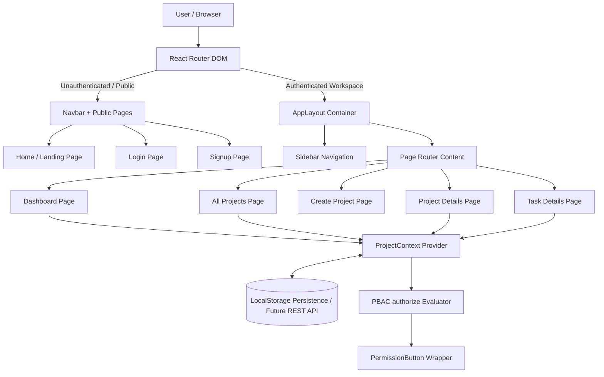

# 🚀 ProjectFlow Frontend — Modern Jira & Linear Inspired Management SaaS

Welcome to the **ProjectFlow** frontend codebase! This repository contains a production-ready, frontend-first React application designed with a **Jira, Linear, and Notion** aesthetic. It provides a full suite of project management, task board (Kanban), and issue tracking features with **Policy-Based Access Control (PBAC)** readiness and clean REST API abstraction layers.

---

## 📑 Table of Contents
1. [Overview & Tech Stack](#-overview--tech-stack)
2. [Prerequisites & Quick Setup](#-prerequisites--quick-setup)
3. [Architecture & End-to-End Data Flow](#-architecture--end-to-end-data-flow)
4. [Folder & File Directory Structure](#-folder--file-directory-structure)
5. [Routing & Layout System](#-routing--layout-system)
6. [State Management & Context API](#-state-management--context-api)
7. [Policy-Based Access Control (PBAC)](#-policy-based-access-control-pbac)
8. [Pages & Core Views](#-pages--core-views)
9. [Component Architecture & Design System](#-component-architecture--design-system)
10. [REST API Readiness & Data Schema](#-rest-api-readiness--data-schema)
11. [Styling & Design Tokens](#-styling--design-tokens)
12. [Developer Onboarding & Guidelines](#-developer-onboarding--guidelines)

---

## 🛠️ Overview & Tech Stack

The ProjectFlow frontend is constructed using modern web technologies to maximize speed, developer experience, and maintainability:

| Technology / Tool | Version / Purpose |
| :--- | :--- |
| **React** | v19.x — Component-driven UI library |
| **Vite** | Build tool & HMR dev server |
| **React Router** | v7.x — Client-side declarative routing |
| **Tailwind CSS** | v4.x — Utility-first CSS engine with OKLCH theme variables |
| **shadcn/ui** | Accessible primitive component design patterns |
| **Lucide React** | Modern SVG icon set |
| **Context API** | Lightweight global state & authentication persistence |

---

## ⚡ Prerequisites & Quick Setup

### Prerequisites
- **Node.js**: v18.0.0 or higher
- **npm**: v9.0.0 or higher

### Installation Commands

```bash
# 1. Clone or navigate to the Frontend directory
cd Frontend

# 2. Install node dependencies
npm install

# 3. Start the local development server
npm run dev
```

The application will launch locally at `http://localhost:5173`.

### NPM Scripts Overview
- `npm run dev`: Boots the Vite HMR development server.
- `npm run build`: Compiles optimized production bundle in `dist/`.
- `npm run preview`: Previews the production build locally.
- `npm run lint`: Scans source files for syntax and code style issues.

---

## 🏗️ Architecture & End-to-End Data Flow

The application follows a **frontend-first, API-ready architecture**. State is managed centrally via `ProjectContext` and synced with `localStorage` for offline persistence until backend endpoints are attached.

### Application Architecture Diagram



### End-to-End Action Lifecycle
1. **Authentication**: User logs in or signs up -> Credentials saved to `ProjectContext` & `localStorage` -> User redirected directly to `/dashboard`.
2. **Navigation**: Clicking sidebar or routing links updates the window history -> `ScrollToTop` resets view scroll to `(0, 0)`.
3. **Authorization Check**: Any critical action button (`Edit Project`, `Delete Task`, `Create Task`) is wrapped in `<PermissionButton action="..." resource="..." />`.
4. **Data Mutation**: Action calls `ProjectContext` methods (`addProject`, `setProjects`) -> Updates Context state and automatically syncs with storage.

---

## 📁 Folder & File Directory Structure

```
Frontend/
├── jsconfig.json                   # Path alias (@/* -> ./src/*) configuration
├── components.json                 # shadcn/ui configuration file
├── vite.config.js                  # Vite configuration with Tailwind CSS plugin
├── package.json                    # Dependencies and scripts
├── public/                         # Static icons and assets
└── src/
    ├── main.jsx                    # React application root entry point
    ├── index.css                   # Tailwind v4 import & OKLCH color theme variables
    ├── App.jsx                     # Route definitions, providers, layout bindings
    │
    ├── lib/
    │   └── utils.js                # cn() classname merger utility (clsx + tailwind-merge)
    │
    ├── context/
    │   └── ProjectContext.jsx      # Global user auth, projects state, & PBAC authorize()
    │
    ├── components/
    │   ├── Navbar.jsx              # Top header bar for public and global branding
    │   ├── ScrollToTop.jsx         # Auto scroll reset helper on page navigation
    │   │
    │   ├── layout/
    │   │   ├── AppLayout.jsx       # Workspace shell container (Sidebar + Main content)
    │   │   └── Sidebar.jsx         # Left navigation sidebar with mobile drawer & collapse
    │   │
    │   ├── common/
    │   │   ├── PermissionButton.jsx# PBAC-aware button wrapper for action permissions
    │   │   ├── StatusBadge.jsx     # Reusable task/project status badge
    │   │   ├── PriorityBadge.jsx   # Reusable priority badge (Low, Medium, High)
    │   │   └── EmptyState.jsx      # Standard empty state card widget
    │   │
    │   ├── dashboard/
    │   │   ├── StatsCard.jsx       # Reusable interactive statistics metric widget
    │   │   ├── ProjectCard.jsx     # Project card with progress bar & status
    │   │   └── TaskCard.jsx        # Compact task card ticket
    │   │
    │   ├── project/
    │   │   ├── ProjectHeader.jsx   # Project page header with title & action controls
    │   │   ├── ProjectOverview.jsx # Overview tab with progress metrics
    │   │   ├── BoardView.jsx       # 3-Column Kanban Board (To Do, In Progress, Done)
    │   │   ├── TaskTable.jsx       # Data table view for tasks with search & filters
    │   │   └── CreateTaskModal.jsx # Modal dialog form for creating new tasks
    │   │
    │   └── ui/                     # shadcn/ui primitive UI design components
    │       ├── alert-dialog.jsx
    │       ├── avatar.jsx
    │       ├── badge.jsx
    │       ├── button.jsx
    │       ├── card.jsx
    │       ├── input.jsx
    │       ├── label.jsx
    │       ├── progress.jsx
    │       ├── separator.jsx
    │       ├── skeleton.jsx
    │       ├── table.jsx
    │       └── tabs.jsx
    │
    └── pages/
        ├── Home.jsx                # Public SaaS landing page with hero illustration
        ├── Login.jsx               # User authentication login page
        ├── Signup.jsx              # User signup page with real-time password validator
        ├── Dashboard.jsx           # Jira-inspired main user dashboard
        ├── Projects.jsx            # All Projects repository grid page
        ├── CreateProject.jsx       # Project creation form page
        ├── ProjectDetails.jsx      # Project detail page (Overview, Board, Tasks tabs)
        └── TaskDetails.jsx         # Dedicated single task details page
```

---

## 🚦 Routing & Layout System

Routing is powered by `react-router-dom` in `src/App.jsx`. Routes are split into two categories:

### 1. Public Routes (No Sidebar)
| Path | Component | Description |
| :--- | :--- | :--- |
| `/` | `Home` | Public landing page with SaaS features overview |
| `/login` | `Login` | User login form |
| `/signup` | `Signup` | User registration with 5-rule real-time password checklist |

### 2. Authenticated Workspace Routes (Wrapped in `AppLayout` + Sidebar)
| Path | Component | Description |
| :--- | :--- | :--- |
| `/dashboard` | `Dashboard` | Main SaaS home with time greeting, 5 stats cards, & recent projects |
| `/projects` | `Projects` | Full grid of all workspace projects with search & category filters |
| `/projects/create` | `CreateProject` | Workspace project creation form |
| `/projects/:projectId` | `ProjectDetails` | Single project management (Overview, Board, Tasks) |
| `/tasks/:taskId` | `TaskDetails` | Dedicated single task details & status management page |
| `/settings` | `Settings` | Workspace settings placeholder |

---

## 🔐 Policy-Based Access Control (PBAC)

Unlike rigid Role-Based Access Control (RBAC), authorization is structured around **Policy-Based Access Control (PBAC)** via a centralized authorization function:

```javascript
authorize(user, action, resource, resourceData)
```

### `<PermissionButton />` Component
All critical action buttons (`Edit Project`, `Delete Project`, `Create Task`, `Delete Task`, `Update Status`) are wrapped in `PermissionButton`:

```jsx
<PermissionButton
  action="delete"
  resource="task"
  resourceData={task}
  variant="destructive"
  onClick={handleDelete}
>
  Delete Task
</PermissionButton>
```

When connected to a backend, `PermissionButton` will evaluate permissions returned by backend APIs without requiring any refactoring of page layouts.

---

## 💾 State Management & Context API

Global state is managed by `ProjectProvider` in [src/context/ProjectContext.jsx](file:///e:/Project-Managemet-System/Frontend/src/context/ProjectContext.jsx).

### Context State Variables:
- `user`: Current authenticated user object (`{ id, fullName, email }`).
- `projects`: Array of workspace projects.
- `authorize()`: Centralized PBAC evaluator helper.

### Persistence:
Both `user` and `projects` are synchronized with `localStorage` (`pf_user` and `pf_projects`) on state mutations.

---

## 🔌 REST API Readiness & Data Schema

All mock data structures are built to mirror production REST API backend models:

### Project Model Schema
```typescript
interface Project {
  id: string;             // e.g. "proj-172251"
  key: string;            // e.g. "KAN"
  name: string;           // e.g. "Kanban Project"
  description: string;    // e.g. "Project description"
  category: string;       // e.g. "Software Development"
  ownerId: string;        // e.g. "usr-101"
  members: string[];      // Array of user IDs
  status: "Active" | "Completed";
  totalTasks: number;
  completedTasks: number;
  pendingTasks: number;
  createdAt: string;
}
```

### Task Model Schema
```typescript
interface Task {
  id: string;             // e.g. "task-101"
  key: string;            // e.g. "KAN-101"
  projectId: string;      // Associated project ID
  name: string;           // Task title
  description: string;    // Detailed objectives
  priority: "Low" | "Medium" | "High";
  status: "To Do" | "In Progress" | "Done";
  dueDate: string;        // e.g. "Aug 15, 2026"
  createdBy: string;      // User name / ID
  assignedTo: string;     // Assignee name / ID
  createdAt: string;
}
```

---

## 🎨 Styling & Design Tokens

Styling is built with **Tailwind CSS v4** utilizing **OKLCH color variables** in [src/index.css](file:///e:/Project-Managemet-System/Frontend/src/index.css) for crisp dark/light themes:

- **Primary Color**: `#3B82F6` (Modern SaaS Blue)
- **Background**: `oklch(0.99 0.005 240)` (#F8FAFC crisp slate)
- **Cards**: Pure White (`#FFFFFF`) with light border lines (`oklch(0.92 0.01 260)`)
- **Status Colors**:
  - `Done` / `Completed`: Emerald Green
  - `In Progress`: Blue
  - `To Do` / `Pending`: Amber / Gray
  - `High Priority`: Destructive Red

---

## 🤝 Developer Onboarding & Guidelines

When contributing to this frontend:
1. **Use Path Aliases**: Always use `@/components/...`, `@/pages/...`, `@/context/...` instead of relative paths (`../../`).
2. **Use PermissionButton**: Wrap all newly introduced mutating user actions in `<PermissionButton />`.
3. **Maintain Component Modularity**: Place reusable UI primitives in `src/components/ui/` and common domain widgets in `src/components/common/`.
4. **Follow Semantic HTML**: Ensure interactive elements use descriptive ARIA attributes and unique IDs.

---
*Maintained by the ProjectFlow Engineering Team.*
